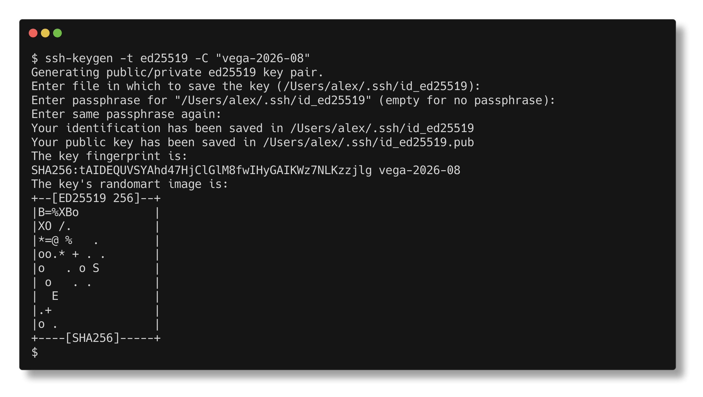
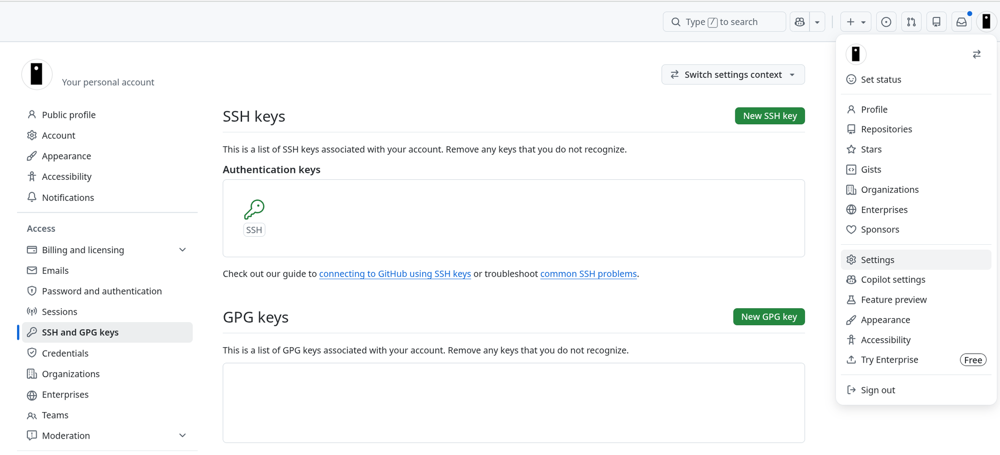
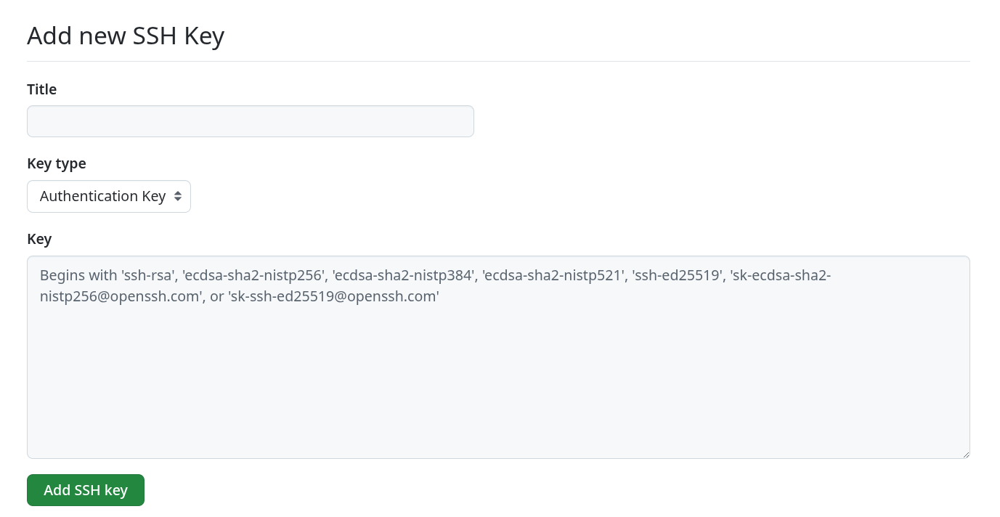
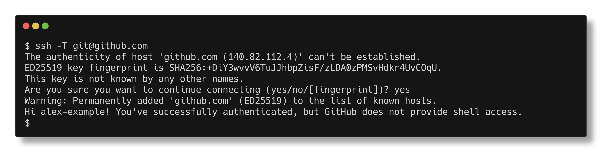
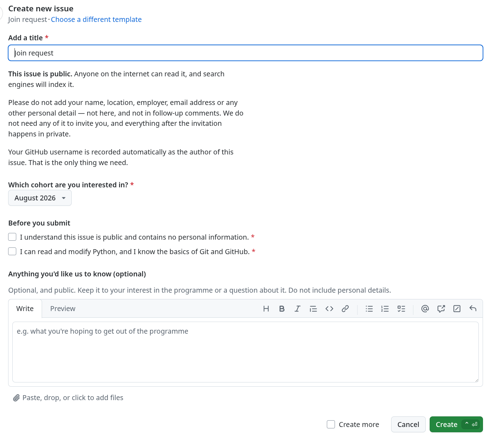

# Start here

RateTick Studio runs **Vega**, a hands-on programme in quantitative trading.
Participants build and test real trading strategies against real market data,
using the same tools and workflows the RateTick platform is built with.

This repository is the entry point. It is public, and it contains one thing: how
to ask for access.

## Who this is for

People who want to build trading strategies and are willing to write some code
to do it. That includes students, and it includes working quants, engineers and
researchers who want a place to experiment outside their day job. The programme
assumes you can read documentation and ask a clear question when you are stuck.

**You should be comfortable with:**

- Reading and modifying Python. You will not be writing much from scratch, but
  you will be changing code and understanding what it does.
- The basics of Git and GitHub — clone, commit, push, open an issue.
- Working in a terminal.

**You do not need:**

- A finance background. The trading concepts are taught.
- Prior experience with market data, backtesting, or trading systems.
- A powerful computer. See [FAQ.md](FAQ.md) for what your machine needs.

If you do not yet have the Git and Python basics, learn them before you join
rather than during.  

## How to join

Five steps, ten to fifteen minutes. Steps 2 and 3 are the important ones:
**your account on the lab server is built from the SSH key on your GitHub
profile.** No key on your profile means no way to log in on day one, and it is
the most common mistake.

### 1. Create a GitHub account

If you already have one, use it — you do not need a separate account for this.
Sign up at [github.com/signup](https://github.com/signup) if you do not. Either
way, sign in.

### 2. Create an SSH key

If you already have one you use with GitHub, skip to step 3.

On macOS open **Terminal**. On Windows 11 open **Terminal** (it runs PowerShell)
— the SSH tools ship with it.

```bash
ssh-keygen -t ed25519 -C "vega-2026-08"
```

Press Enter to accept the default location. A passphrase is optional; if you set
one, you will be asked for it each time the key is used.



### 3. Add the key to your GitHub account

Step 2 made two files. Copy the **public** one — the file ending `.pub`. Never
share the other one; that is your private key and it never leaves your machine.

This copies the public key to your clipboard:

```bash
cat ~/.ssh/id_ed25519.pub | pbcopy               # macOS
Get-Content ~\.ssh\id_ed25519.pub | clip         # Windows
```

Then go to **Settings → SSH and GPG keys** on GitHub (your avatar, top right,
opens the menu) and click **New SSH key**:



Give it any title, leave **Key type** as *Authentication Key*, paste into the
**Key** box, and click **Add SSH key**:



### 4. Check the key works

```bash
ssh -T git@github.com
```

The first time, it will ask whether to trust github.com —
*"Are you sure you want to continue connecting (yes/no/[fingerprint])?"* — type
`yes` and press Enter.

If you then see *"Hi «your-username»!"*, you are done — the "shell access"
wording in that message is normal and not an error.



### 5. Open a join request

[Open a join request →](https://github.com/ratetick-studio/start-here/issues/new?template=join-request.yml)

The form asks which cohort you are interested in; if the current one does not
suit, you can ask to be kept in mind for a later one. Your GitHub username is
recorded automatically. **It does not ask for your name, your location, your
employer, or your email**, and you should not add them — the issue is public and
anyone on the internet can read it.



## What happens next

We will send you an invitation to the RateTick Studio GitHub organisation and
close your request. Everything after that point is private.

Accept the invitation and you will have access to `vega-lab`, which is where the
programme actually runs — orientation, environment setup, the labs, and the
discussion where questions get asked and answered.

Your organisation membership is **private by default**. It will not appear on
your public GitHub profile unless you choose to make it visible.

We aim to answer join requests within a few days. If a cohort is full or has
already started, we will tell you.

## Questions

[FAQ.md](FAQ.md) covers the ones we get most often — time commitment, hardware,
cost, and whether this is for you.

Anything else, ask in your join request. A public issue is not the place for
anything you would not want indexed by a search engine.
